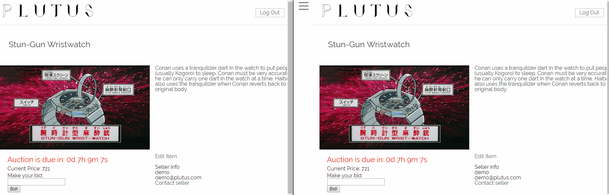
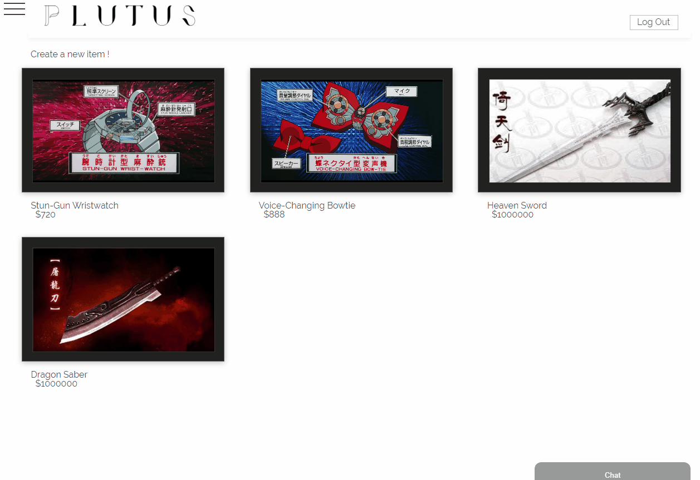
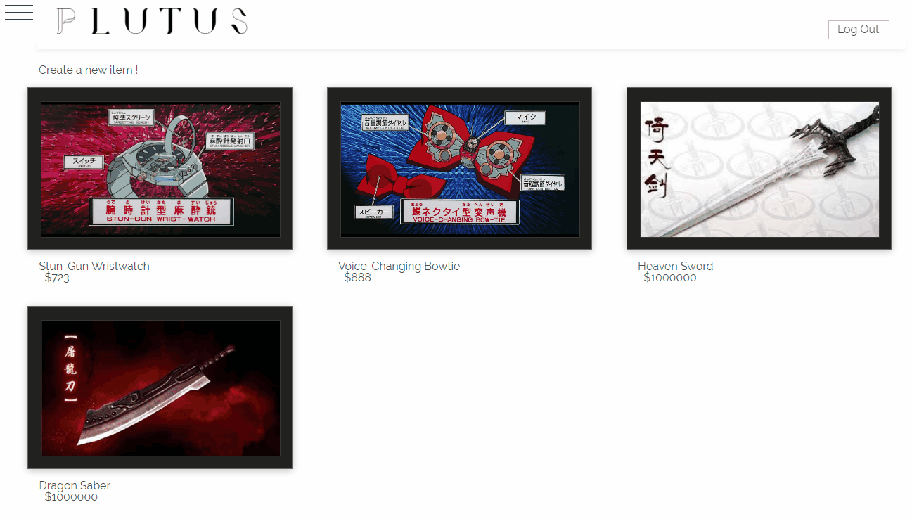

# Plutus

Plutus is an auction bidding web app where users are allowed to bid on luxurious
products they like, or sell products for other users to bid.

[Live Demo](https://plutus-5566.herokuapp.com/#/)

## Functionaliy and MVP
* An "interactive" welcome page 
* Make a bid on an item and the latest price will be announced to all users in real-time. 
* A google map that shows users where the bidding location is 
* A user profile that shows the items they are selling or allows message inquiry 
* Inbox for enquiry where users can send or receive messages from other users 
* A chatbot that can help you search items or change the language 
* A search form that the user can search for items 
* Responsive design 

## Technologies and Technical Challenges
The technologies used for this project are:
* GraphQL
* Mongoose
* Node
* Apollo
* Websocket
* Cloudinary
  
The primary technical challenges we have identified so far are:
* integrating google map into our app as well and to show the actual time before
  the bidding session ends for one product
* chatting feature and chatbot require the implementation of websocket

## Group members
Our team consists of three members:
* [Roger](https://github.com/yuichiu416)
* [Stan](https://github.com/stanbond)
* [Winnie](https://github.com/chinweenie)

## Usage
``npm install`` in the root directory **AND** in the client directory

``npm run dev`` 